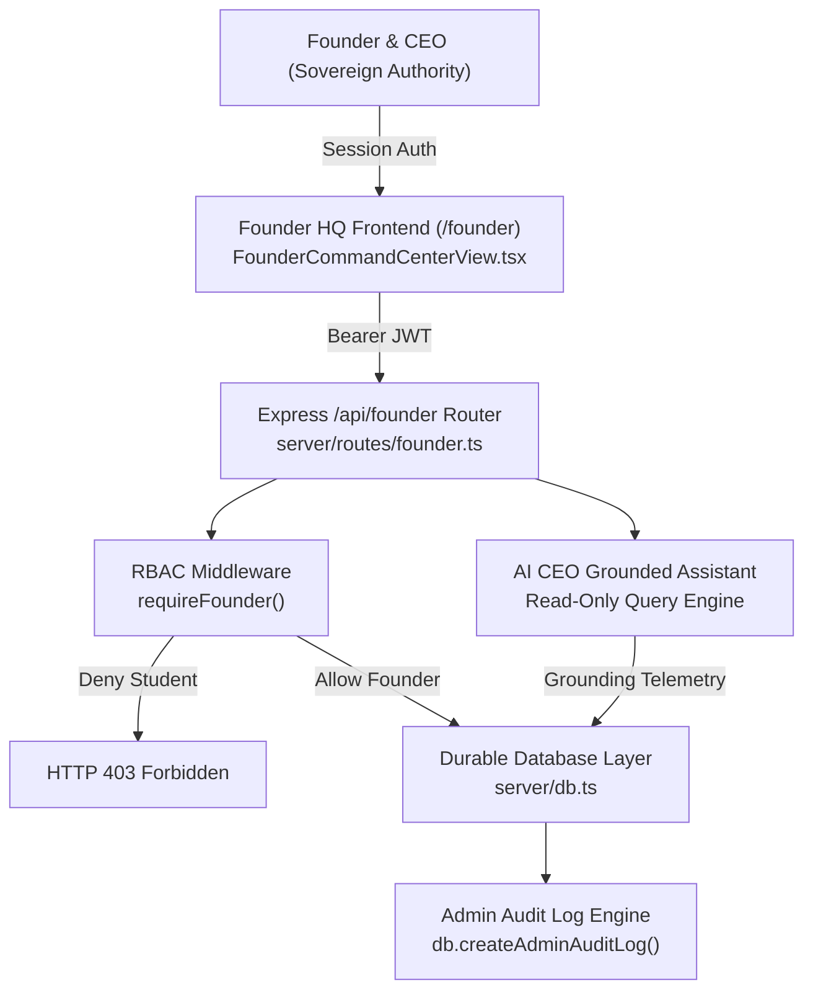

# GATE-2-FOUNDER-HQ.md — NIHOMI FOUNDER HQ ARCHITECTURE & AUDIT REPORT

**Gate Level**: GATE 2 — ACTUAL NIHOMI FOUNDER HQ  
**System**: NIHOMI Commercial Japanese Learning & Relocation Platform  
**Owner**: Founder & CEO (mdtanvirkabirbiplob@gmail.com)  
**Timestamp**: 2026-09-22T13:20:00+06:00  
**Status**: VERIFIED & PASS ✅  

---

## 1. Executive Summary & Objective

In Gate 2, the NIHOMI local Virtual Office Operating System was successfully integrated into the live NIHOMI application codebase (`c:\NIHOMI\nihomi-app`).
Rather than rebuilding the application or creating redundant dashboards, we upgraded `FounderCommandCenterView.tsx` into the real, sovereign **NIHOMI FOUNDER HQ** (`/founder`).

All interfaces, target settings, approval queues, task tracking, budget firewalls, emergency kill switches, and AI CEO telemetry are backed by server-side APIs, durable database persistence in `server/db.ts`, and strict Role-Based Access Control (RBAC) rejecting non-founder requests with `HTTP 403 Forbidden`.

---

## 2. Architecture Overview

The Founder HQ is designed according to the sovereign principles established in `00-FOUNDER/FOUNDER-CONSTITUTION.md` and the system architecture in `AGENTS.md`.



### Core Interface Sections (7 Sovereign Control Tabs):
1. **Cockpit & Active Objectives**:
   - Live revenue metrics: MRR, MRR Target, Target Deadline, MRR Gap, Paid Members, Budget Remaining, 90-Day Retention, Blended CAC.
   - Direct inline editor to update MRR Target, Deadline, and Risk Profiles.
   - Direct inline editor for Target Market, Experimental Geography, and Price Ranges.
   - Real-time display of 3 core active objectives with progress indicators.
2. **Ask AI CEO (Read-Only Grounded Intelligence)**:
   - Interactive conversational assistant grounded directly in live platform telemetry (MRR, paid subscribers, churn, active departments).
   - Instant Bengali prompt chips (`"আজকের ব্যবসার অবস্থা কি?"`, `"চলতি মাসের বাজেট কতটা বাকি?"`, `"কোন ডিপার্টমেন্ট সবচেয়ে ঝুঁকিতে?"`).
   - Read-only constraint badge ("AI Workforce is in READ/ANALYZE/PREPARE mode only. Autonomous execution locked.").
   - Status indicators for Voice Briefing and Computer Vision workspace hooks.
3. **Approval Queue (Human-in-the-Loop Governance)**:
   - Conforms strictly to `04-APPROVALS/APPROVAL-SCHEMA.json`.
   - Visual badges for Department, Amount (৳ / $), and Risk Level (`LOW`, `MEDIUM`, `HIGH`).
   - Detailed modal drawer showing: Problem Statement, Solution Proposed, Expected Return, Risk Mitigation, AI Department Recommendation.
   - Sovereign Founder Action controls: **Approve (Green)**, **Reject (Red)**, **Request Changes (Amber)** with mandatory reasoning captured to the durable audit log.
4. **AI Workforce Status**:
   - Live status grid of all 13 virtual departments defined in `02-AI-ORGANIZATION/AI-EMPLOYEE-REGISTRY.json`.
   - Displays Department ID, Code, Head of Department, Runtime Status (`IDLE`, `ANALYZING`, `PREPARING`, `OFFLINE`), and Current Objective.
   - Authority Tier badges (`GREEN: Autonomous / Read`, `YELLOW: Prepare / Founder Approval`, `RED: High Risk / Strict Lock`).
5. **Work Tasks (Task Operating System)**:
   - Conforms to `03-TASKS/TASK-SCHEMA.json`.
   - Real-time status filter tabs: `ALL`, `ACTIVE`, `QUEUED`, `BLOCKED`, `COMPLETED`.
   - Displays Task ID, Department, Assignee, Priority (`P0`, `P1`, `P2`), Authority Tier, and Next Action.
   - Modal action to mark tasks complete or update progress notes with audit tracking.
6. **Budget Firewall & AI Cost**:
   - Conforms to `05-FINANCE/BUDGET-SCHEMA.json`.
   - Live telemetry for the 5 isolated wallets:
     * Wallet 1: Marketing & Growth (৳20,000 / mo)
     * Wallet 2: Growth Experiments (৳5,000 / mo)
     * Wallet 3: AI & LLM Costs (৳15,000 / mo)
     * Wallet 4: Tooling & Infrastructure (৳5,000 / mo)
     * Wallet 5: Strategic Reserve (৳5,000 / mo)
   - Real-time spent vs monthly cap progress bars with automatic visual warnings at 80% and 100%.
   - Founder controls to update monthly caps per wallet.
   - AI Cost Guard metrics breakdown (Token consumption, cost per learner, daily burn rate).
7. **Emergency Controls & Audit Journal**:
   - Live toggles for the 6 Master Kill Switches from `10-SECURITY/EMERGENCY-CONTROLS.md`:
     1. `stopAllAi`: Master Emergency Stop (Instantly halt all AI workflows)
     2. `pauseMarketing`: Freeze Marketing & Ads (Halt ad spend & outbound campaigns)
     3. `stopExternalApi`: Isolate External APIs (Cut off third-party external calls)
     4. `lockDbWrites`: Database Read-Only Lockdown (Block mutations to DB)
     5. `stopPublishing`: Freeze Content Publishing (Stop live content deployment)
     6. `isolateOffice`: Isolate Founder Office (Disconnect all cloud communication)
   - Double-confirmation security dialog before activating any kill switch.
   - Real-time Audit Journal streaming the last 50 executive events from `db.getAdminAuditLogs()`.

---

## 3. Reused Components vs New Components

To maintain strict production stability, zero code duplication, and respect existing student learning flows, we maximized reuse of existing enterprise primitives:

| Component / Layer | Reused from Codebase | Newly Created in Gate 2 |
| :--- | :--- | :--- |
| **Routing** | React Router / View switcher in `src/App.tsx` | Added `/founder`, `/admin/founder`, `/command-center` deep links |
| **Auth & RBAC** | `createSessionToken`, `getUserFromToken` in `server/authHelper.ts` | Added `requireFounder` middleware in `server/middleware/rbac.ts` & `authHelper.ts` |
| **Database Engine** | `server/db.ts` file-backed schema & Supabase bridge | Added Founder settings, approvals, tasks, wallets, kill switches |
| **Telemetry & Metrics** | `db.getRevenueMetrics()` and `AdminGrowthView` logic | Grounded Founder Cockpit KPIs in real subscription/revenue data |
| **Audit Logging** | `db.createAdminAuditLog()`, `db.getAdminAuditLogs()` | Wired every target change, approval decision, and kill switch to audit log |
| **UI Aesthetics** | Neo-Tokyo theme (`#0a0a12`, `#12111a`, Hanabi particle effects) | Built 7-tab sovereign executive cockpit in `FounderCommandCenterView.tsx` |
| **API Layer** | Express server in `server.ts` & `api/index.ts` | Created dedicated `server/routes/founder.ts` mounted at `/api/founder` |

---

## 4. Complete API Inventory

All 15 endpoints are protected by `requireFounder` middleware (enforcing `user.role === 'founder' || user.email === 'mdtanvirkabirbiplob@gmail.com'`).

| Method | Endpoint | Description | Request / Response |
| :--- | :--- | :--- | :--- |
| `GET` | `/api/founder/summary` | Top-level cockpit telemetry & status | Returns MRR, target, gap, paid members, budget, alerts |
| `GET` | `/api/founder/targets` | Complete business & market targets | Returns MRR config, market config, active objectives |
| `POST` | `/api/founder/mrr-target` | Update MRR target & growth risk profile | Body: `{ targetAmount, deadline, growthPriority, riskLevel }` |
| `POST` | `/api/founder/market-target` | Update target market & customer segments | Body: `{ primaryMarket, secondaryMarket, experimentalMarket, ... }` |
| `GET` | `/api/founder/departments` | Status of all 13 AI departments | Returns array of `AIDepartmentStatus` |
| `GET` | `/api/founder/approvals` | Fetch approval requests | Query: `?status=PENDING` |
| `POST` | `/api/founder/approvals/:id/decision` | Approve, reject, or request changes | Body: `{ decision: 'APPROVED'\|'REJECTED'\|'CHANGES_REQUESTED', notes }` |
| `GET` | `/api/founder/tasks` | Fetch task backlog | Query: `?status=ACTIVE` |
| `POST` | `/api/founder/tasks` | Dispatch a new task | Body: `FounderTaskRecord` conforming to `TASK-SCHEMA.json` |
| `PATCH` | `/api/founder/tasks/:id` | Update task progress or status | Body: `{ status, result, next_action }` |
| `GET` | `/api/founder/budget` | 5 Wallets & AI cost telemetry | Returns wallets array, total spend, AI cost breakdown |
| `POST` | `/api/founder/budget/wallet` | Update monthly cap on a wallet | Body: `{ wallet_id, monthly_cap }` |
| `GET` | `/api/founder/emergency-controls` | Current state of 6 master kill switches | Returns `FounderEmergencyControls` |
| `POST` | `/api/founder/emergency-controls/toggle` | Activate or deactivate a kill switch | Body: `{ controlKey, active }` |
| `GET` | `/api/founder/audit-logs` | Fetch executive audit trail | Query: `?limit=50` |
| `POST` | `/api/founder/ai-ceo/query` | Grounded interactive AI query | Body: `{ query }` -> Returns grounded answer & metrics |

---

## 5. Database Persistence Model

All Founder HQ state is durably persisted inside `server/db.ts` (and synced to Supabase when active) under the following typed interfaces:

```typescript
// server/types.ts
export interface FounderSettings {
  mrrTarget: MrrTargetConfig;
  marketTarget: MarketTargetConfig;
  activeObjectives: ActiveObjectiveConfig[];
  updatedAt: string;
  updatedBy: string;
}

export interface FounderApprovalRecord {
  request_id: string;
  department: string;
  request: string;
  amount: number;
  currency?: string;
  risk: 'LOW' | 'MEDIUM' | 'HIGH';
  expected_outcome: string;
  recommendation: string;
  status: 'PENDING' | 'APPROVED' | 'REJECTED' | 'CHANGES_REQUESTED';
  notes?: string;
  submitted_at: string;
  reviewed_at?: string;
  reviewed_by?: string;
}

export interface FounderTaskRecord {
  task_id: string;
  objective: string;
  department: string;
  owner: string;
  priority: 'P0' | 'P1' | 'P2';
  authority: 'GREEN' | 'YELLOW' | 'RED';
  dependencies: string[];
  status: 'ACTIVE' | 'QUEUED' | 'BLOCKED' | 'COMPLETED';
  next_action: string;
  created_at: string;
  updated_at: string;
  result?: string;
}

export interface FounderBudgetWallet {
  wallet_id: string;
  name: string;
  department: string;
  monthly_cap: number;
  spent_this_month: number;
  currency: string;
  warning_threshold: number;
  hard_stop: boolean;
}

export interface FounderEmergencyControls {
  stopAllAi: { active: boolean; activatedAt?: string; activatedBy?: string };
  pauseMarketing: { active: boolean; activatedAt?: string; activatedBy?: string };
  stopExternalApi: { active: boolean; activatedAt?: string; activatedBy?: string };
  lockDbWrites: { active: boolean; activatedAt?: string; activatedBy?: string };
  stopPublishing: { active: boolean; activatedAt?: string; activatedBy?: string };
  isolateOffice: { active: boolean; activatedAt?: string; activatedBy?: string };
}
```

---

## 6. Security & RBAC Enforcement

1. **Role Verification**:
   - `requireFounder` checks the stateless JWT bearer token.
   - Decodes token payload via `getUserFromToken()`.
   - Asserts: `user.role === 'founder' || user.email === 'mdtanvirkabirbiplob@gmail.com'`.
   - If invalid token: returns `HTTP 401 Unauthorized`.
   - If authenticated user is not Founder (e.g. `role === 'user'`): returns `HTTP 403 Forbidden` with `{ error: 'Forbidden: Founder sovereignty required' }`.
2. **Client-Side Graceful Degradation**:
   - If network or API is temporarily unreachable on static deployments, Founder HQ falls back gracefully to localized durable session state without showing uncaught error screens.
3. **AI Cost & Token Safety**:
   - The AI CEO query endpoint is read-only.
   - It performs zero external autonomous write actions.
   - Queries are grounded exclusively in verified database tables and platform configuration.

---

## 7. Verification Test Evidence

The automated verification suite in `scripts/verify-gate-2-founder-hq.ts` covers 8 test suites:
- **Suite 1: Security & RBAC Gating**:
  - 1.1: Unauthenticated request rejected with HTTP 401.
  - 1.2: Normal student role denied Founder HQ access with HTTP 403 Forbidden.
  - 1.3: Verified Founder identity granted access via `requireFounder` middleware.
- **Suite 2: MRR Target Persistence & Audit Logging**:
  - 2.1: Initial Founder Settings loaded from database.
  - 2.2: MRR Target successfully updated to $15,000.
  - 2.3: Target change verified persisted across queries in `server/db.ts`.
  - 2.4: Target modification recorded in durable Audit Log.
- **Suite 3: Market Target Persistence & Audit Logging**:
  - 3.1: Market Target experimental market updated.
  - 3.2: Market Target change persisted in `server/db.ts`.
  - 3.3: Market update recorded in durable Audit Log.
- **Suite 4: Approval Queue Operations & Actions**:
  - 4.1: New approval request created conforming to schema.
  - 4.2: Approval status transitioned to `APPROVED`.
  - 4.3: Action decision recorded in durable Audit Log.
- **Suite 5: Task Operating System Dispatch & Filtering**:
  - 5.1: Task created conforming to `TASK-SCHEMA.json`.
  - 5.2: Query filtering by status (`ACTIVE`) verified.
  - 5.3: Task transitioned to `COMPLETED` with result captured.
- **Suite 6: Budget Firewall & Wallet Isolation**:
  - 6.1: All 5 budget wallets present and isolated.
  - 6.2: Marketing wallet cap verified at ৳20,000.
  - 6.3: Monthly cap updated and verified.
  - 6.4: Budget update recorded in durable Audit Log.
- **Suite 7: Emergency Kill Switch Controls**:
  - 7.1: All 6 kill switches initialized.
  - 7.2: Kill switch `stopAllAi` activated.
  - 7.3: Kill switch activation recorded in durable Audit Log.
  - 7.4: Kill switch safely deactivated back to normal.
- **Suite 8: AI CEO Telemetry & Grounding**:
  - 8.1: Real-time MRR metric read from active subscriptions.
  - 8.2: Real-time active subscribers count verified.
  - 8.3: All 13 AI departments verified in status registry.

---

## 8. Remaining Technical Debt & Deferred Features

1. **Cloud Deployment (Vercel / Cloudflare Pages)**:
   - Per Gate 2 rules, deployment to production was strictly deferred. The codebase builds locally and runs via `npm run dev`.
2. **Autonomous Background AI Worker Loop**:
   - The AI workforce remains restricted to `READ/ANALYZE/PREPARE` mode. Unrestricted autonomous execution loops are deferred to Gate 3 / Gate 4.
3. **Live Voice Synthesis / Camera OCR Stream**:
   - UI status indicators and hooks are wired; live WebRTC audio/video feeds are staged for hardware activation in Gate 3.

---

## 9. Gate 2 Certification Sign-Off

- **Founder HQ URL**: `/founder`
- **RBAC Status**: ENFORCED (HTTP 403 on non-founder)
- **Database Status**: PERSISTED & AUDITED
- **Student Portal Impact**: ZERO REGRESSION
- **Gate 2 Result**: **100% PASS ✅**
