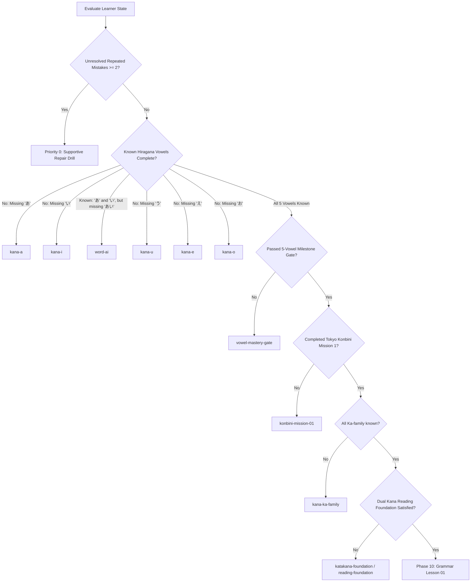

# 🗾 NIHOMI LEARNING JOURNEY SPECIFICATION
## The Autonomous Journey Engine: Zero Japanese → Japan Ready
**Document Version:** 1.0.0  
**Constitution Version:** 1.0.0  
**Curriculum Graph Version:** 1.0.0  
**Learner State Version:** 1.0.0  

---

## 1. EXECUTIVE OVERVIEW
The Nihomi Learning Journey Engine is the authoritative state machine guiding a student through the 14 canonical curriculum phases of the Japanese language. Every progression step is governed by **Pedagogical Law**:
> *A learner must NEVER encounter an untaught Japanese character, sound-symbol combination, vocabulary word, or grammar rule inside learner-facing content unless the prerequisite has been explicitly unlocked in their knowledge state.*

The core user experience satisfies the product thesis:
> *"I always know where I am, and I always know what to do next."*

---

## 2. THE 14-PHASE CURRICULUM ROADMAP

| Phase | Identifier | Focus | Prerequisites | Gate Condition |
|---|---|---|---|---|
| **0** | `phase_0_zero_entry` | First contact, sound, tactile discovery | None | Complete 1st character trace |
| **1** | `phase_1_hiragana_foundation` | Vowels (`あいうえお`), 1st word (`あい`), stroke order | `zero-entry` | 5-Vowel Milestone Review Gate |
| **2** | `phase_2_hiragana_core` | Consonant families (`か〜ん`) | Phase 1 + Milestone Gate | Complete 46 core hiragana |
| **3** | `phase_3_hiragana_mechanics` | Dakuten, Handakuten, Sokuon (っ), Youon (ゃゅょ) | Phase 2 | Mechanics mastery check |
| **4** | `phase_4_hiragana_reading_mastery` | High-fluency hiragana reading drills | Phase 3 | Timed sentence reading |
| **5** | `phase_5_katakana_foundation` | Katakana vowels & key technological rows | Phase 4 | Katakana foundation check |
| **6** | `phase_6_katakana_mastery` | Complete 46 Katakana & Foreign Loanwords | Phase 5 | Loanword reading mastery |
| **7** | `phase_7_reading_foundation` | Dual-script integrated reading (Hiragana + Katakana) | Phase 6 | **Foundation Verification Gate** (Required for Grammar) |
| **8** | `phase_8_vocabulary_os` | High-frequency Core 800 Japanese words | Phase 7 | Core vocabulary checks |
| **9** | `phase_9_kanji_vocabulary` | Essential 100 N5 Kanji & Radicals | Phase 7 | Kanji recognition check |
| **10** | `phase_10_grammar` | Sentence structure, particles (`は`, `が`, `を`, `に`), `です` | Phase 7 Gate passed | Lesson quizzes |
| **11** | `phase_11_sentence_building` | Verb conjugations (Te-form, Masu-form, Nai-form) | Phase 10 | Interactive builder pass |
| **12** | `phase_12_listening_speaking` | Conversational fluency & audio drills | Phase 11 | Voice pronunciation score |
| **13** | `phase_13_real_life_missions` | Tokyo Konbini, Yamanote line subway, bank/post | Phase 10 & 12 | Roleplay simulation pass |
| **14** | `phase_14_japan_readiness` | JLPT N5 Official Mock Exams, Baito readiness, Visa | Phase 10–13 | Full exam pass (>= 70%) |

---

## 3. THE STRICT CUMULATIVE LATTICE (PHASE 1 DEEP-DIVE)

In Phase 1, the vowel progression is non-negotiably locked:

```
[Stage 1: あ]
  │  (Activities: Hear 'a', Trace 3 strokes, Recall. NO WORDS ALLOWED.)
  ▼
[Stage 2: い]
  │  (Activities: Hear 'i', Trace 2 strokes.)
  ▼
[First Word Unlock: あい (Ai = ভালোবাসা)]
  │  (First combination of known {あ, い}. 'いい' (Ii) also unlocked.)
  ▼
[Stage 3: う]
  │  (Unlocks: いう, あう. Controlled 3-vowel universe.)
  ▼
[Stage 4: え]
  │  (Unlocks: いえ, うえ, え.)
  ▼
[Stage 5: お]
  │  (Unlocks: あお, おおい.)
  ▼
[5-Vowel Milestone Review Gate]
  │  (5-question diagnostic test verifying vowel mastery.)
  ▼
[Phase 2: Consonants か〜ん]
```

### Inviolable Safeguard:
Under no circumstances may a word like `あさ` (Asa = সকাল) appear in Phase 1, because `さ` belongs to the consonant series (Phase 2).

---

## 4. NEXT BEST MISSION ENGINE ALGORITHM

The function `getNextBestMission(state: LearnerKnowledgeState): NextBestMission` evaluates priorities in the following strict order:



---

## 5. EXPERIENCED LEARNER PLACEMENT ENGINE

For learners arriving with prior Japanese experience:
1. **5-Question Diagnostic Assessment:**
   - Q1: Vowel word recognition (`あい`)
   - Q2: Consonant row identification (`さ` vs `き`/`た`)
   - Q3: Vocabulary reading (`ありがとう`)
   - Q4: Katakana loanword recognition (`コーヒー`)
   - Q5: Basic particle usage (`わたし は がくせいです`)
2. **Tier Mapping:**
   - **Score 5/5:** `dual_kana_mastered` → Placed at `grammar-n5-lesson-01`.
   - **Score 3–4/5:** `hiragana_mastered` → Placed at `katakana-foundation`.
   - **Score 2/5:** `vowels_known` → Placed at `kana-ka-family`.
   - **Score 0–1/5:** `zero_beginner` → Placed at `kana-a`.
3. **Retroactive Prerequisite Hydration:**
   When a tier is assigned, `applyPlacementResult()` automatically injects all prerequisite characters, vocabulary, and milestone skills into `LearnerKnowledgeState`, ensuring that subsequent system gates evaluate cleanly without false locking.

---

## 6. PREVENTING DIRECT ROUTE TAMPERING

If a learner attempts to access a URL directly (e.g. `?lessonId=n5-l2` or `/lesson?id=2`), `getLessonGateStatus()` checks:
- Is the learner grammar-eligible?
- If not, `PrerequisiteFoundationGate` is rendered in place of the lesson content, displaying:
  1. The missing prerequisites in warm Bengali.
  2. A direct CTA button to the learner's true `NextBestMission`.
- The curriculum engine strictly refuses to render premature lessons.

---
*Maintained by the Nihomi Lead Product & Curriculum Engineering Team.*
